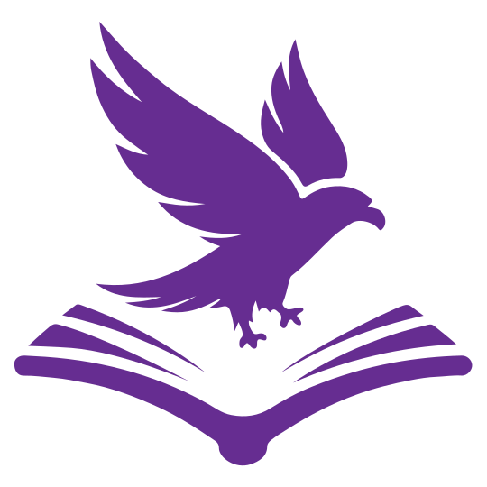

# Docoru

{"width": "200px"}

> Мотивация для разработки системы заключается в том, чтобы предоставить пользователям быстро писать свою документацию без лишних действий и без проблем с излишними нагрузками с ограниченными ресурсами. Основной сегмент для потребления - государственные структуры и малые бизнесы, так как именно они страдают от наплыва пользователей или ддос атак.

Добро пожаловать в систему для ведения документации! Полностью открытый код с откроытой лицензией, без теневых пакетов и прочее, что подойдет даже для государственных структур. Ниже приведен обзор основных фишек, которые выделяют нашу систему на фоне конкурентов и делают разработку документации более гибкой и эффективной.

## Основные возможности

### Инициализация
Система позволяет быстро инициализировать проект, без лишних хлопот и скомпилировать готовый проект в HTML файлы, что позволяет быстро залить на CDN.

### Поддержка Tailwind и HTML кода в Markdown
Теперь вы можете вставлять код Tailwind или HTML непосредственно в ваши Markdown файлы. Это устраняет необходимость в написании дополнительных стилей и упрощает разработку.

### Инклуды файлов
Легко включайте и компонуйте различные файлы в вашей документации. Это позволяет поддерживать модульную структуру и управлять документами более эффективно.

### Статическая и динамическая компиляция (SSR)
Выбирайте между статической и динамической (Server-Side Rendering) компиляцией в зависимости от ваших нужд и требований к производительности.

### Поддержка компиляции переменных через Mustache
Используйте мощный движок Mustache для компиляции переменных. Это позволяет легко создавать шаблоны и увеличивает гибкость вашего контента.

### Локализация и поддержка нескольких языков
Создайте документацию, доступную для глобальной аудитории, с поддержкой нескольких языков. Ваша документация будет доступна на любом языке, который вы выберете.

### Поддержка редиректов
Организуйте и перенаправляйте трафик согласно вашим потребностям без дополнительных усилий. Поддержка редиректов помогает сделать вашу документацию более управляемой.

### Поиск по документации
Встроенная функция поиска позволяет быстро находить нужную информацию в вашей документации, что значительно улучшает удобство использования.

### Поддержка Web Components и иконок
Используйте Web Components и любые иконки без необходимости подключения дополнительных зависимостей, что делает вашу документацию еще более гибкой.

### Горячая компиляция для разработки
Процесс разработки становится мгновенным и удобным благодаря функции горячей компиляции. Это экономит время и улучшает настройку.

### Высокая производительность
Наша система обеспечивает лучшую производительность в сравнении со всеми конкурентами, что гарантирует плавную работу даже с большими объёмами данных.

### Поддержка интерактивных элементов
Система позволяет использовать интерактивные элементы, такие как вкладки, сворачиваемые элементы, аккордеоны и прочее. Это делает вашу документацию более динамичной и увлекательной для пользователей, улучшая взаимодействие и восприятие информации.

### Поддержка разных режимов, включая iframe и вырезку блоков
Ваша документация может быть встроена в другие системы благодаря поддержке различных режимов. Используйте iframe или вырезку целых блоков по id заголовка, чтобы интегрировать содержимое в другие проекты или системы управления контентом. Это расширяет возможности использования документации и делает её более универсальной. 

### Поддержка формул LaTeX
Вставляйте сложные математические формулы в вашу документацию с помощью KaTeX, делая её полезной для технической и научной аудитории.

### Поддержка графов Mermaid
Создавайте и визуализируйте графы и диаграммы с помощью Mermaid. Это отличный инструмент для иллюстрации сложных процессов и связей.

Каждая из этих функций призвана улучшить ваше взаимодействие с системой и облегчить создание профессиональной и доступной документации. Мы надеемся, что они помогут вам в полной мере реализовать потенциал вашей работы.